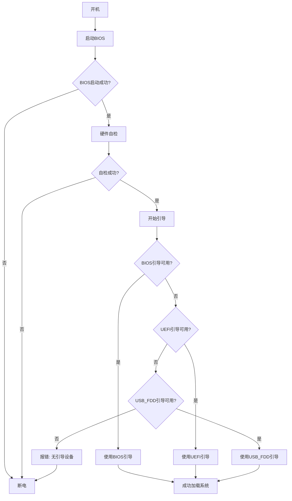
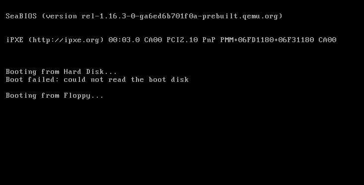
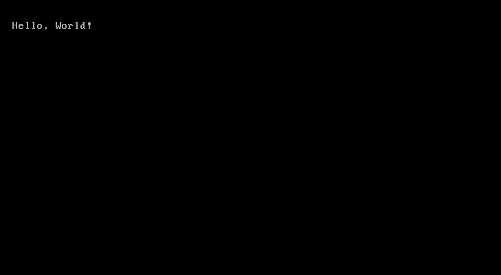

# 02. 开始写引导程序

## 02.1 引导程序介绍

这个引导程序分为三个

1. BIOS
2. UEFI
3. USB_FDD

其中，USB_FDD是针对USB启动盘的引导程序，BIOS和UEFI是针对硬盘的引导程序(其实BIOS也是电脑必须的，没有BIOS，就开不了机，我说的BIOS指的是主板固件)

说一下启动过程


就这样了

## 02.2 开始编写

咱们开始写代码了

新建一个文件`boot.asm`后开始编写代码

```asm
org 0x7c00

times 510-($-$$) db 0
dw 0xaa55

```
解释一下

```asm
org 0x7c00
```
告诉编译器，这个程序从0x7c00开始

```asm
times 510-($-$$) db 0
```
填充0，直到510字节

```asm
dw 0xaa55
```
填充0xaa55，这是引导扇区的标识

然后咱们编译一下

```bat
nasm boot.asm -o boot.bin
dd if=/dev/zero of=disk.img bs=512 count=2880
dd if=boot.bin of=disk.img bs=512 count=1
qemu-system-i386 -hda disk.img
```

运行如图所示



然后把清屏的代码加上
boot.asm(部分)

```asm
clear_screen:
    mov ax, 0x600 ; AH=06h：向上滚屏，AL=00h：清空窗口
    mov bx, 0x700 ; 空白区域缺省属性
    mov cx, 0 ; 左上：(0, 0)
    mov dx, 0x184f ; 右下：(80, 25)
    int 10h ; 执行
    ret

```

然后添加`call Clear_screen`后运行

如图所示


看起来不美观，优化一下
```asm
clear_screen:
    mov ax, 0x600 ; AH=06h：向上滚屏，AL=00h：清空窗口
    mov bx, 0x700 ; 空白区域缺省属性
    mov cx, 0 ; 左上：(0, 0)
    mov dx, 0x184f ; 右下：(80, 25)
    int 10h ; 执行
    mov ah, 0x02 ; AH=02h：设置光标位置
    mov bh, 0
    mov dh, 0
    mov dl, 0
    int 0x10
    ret
```


看起来好多了

然后咱们在这里面实现一下print函数

因为，打印一行字要三行，还不能输入两个英文字，很是麻烦，所以咱们在这里面实现一个print函数

首先，咱们了解一下是怎么打印的
只需要把`ah = 0x0E`，然后`al = '<需要打印的字符>'`，最后调用**0x10**中断即可
知道其原理后就开始写代码了

```asm
print:
    mov ah, 0x0E    ; 设置显示字符功能
.print_loop:
    mov al, [si]    ; 获取当前字符
    cmp al, 0       ; 检查是否到达字符串末尾
    je .done        ; 如果是，跳转到结束
    ; 检查是否为换行符
    cmp al, 0x0A    ; 检查是否为换行符
    je .new_line    ; 如果是，跳转到换行处理
    ; 检查是否为数字标记
    cmp al, '#'     ; 检查是否为数字标记
    je .print_number ; 如果是，跳转到数字处理
    ; 否则，打印字符
    int 0x10        ; 显示字符
    inc si          ; 移动到下一个字符
    jmp .print_loop ; 继续循环
.new_line:
    ; 先输出回车符
    mov al, 0x0D    ; 设置回车符
    int 0x10        ; 显示回车符
    ; 再输出换行符
    mov al, 0x0A    ; 设置换行符
    int 0x10        ; 显示换行符
    inc si          ; 移动到下一个字符
    jmp .print_loop ; 继续循环
.print_number:
    inc si          ; 跳过'#'标记
    ; 获取数字值
    xor ax, ax      ; 清空ax
    mov al, [si]    ; 获取第一个字节
    inc si
    mov ah, [si]    ; 获取第二个字节
    inc si
    call print_number16 ; 调用数字打印函数
    jmp .print_loop ; 继续循环
.done:
    ret             ; 返回

; 打印16位数字的函数
print_number16:
    pusha           ; 保存所有寄存器
    mov cx, 0       ; 初始化计数器
    mov bx, 10      ; 设置除数为10
    
.convert_loop:
    xor dx, dx      ; 清空dx
    div bx          ; ax = ax / 10, dx = ax % 10
    push dx         ; 将余数(数字)压入栈
    inc cx          ; 增加计数器
    cmp ax, 0       ; 检查商是否为0
    jne .convert_loop ; 如果不是，继续循环
    
.print_loop:
    pop dx          ; 从栈中弹出数字
    add dl, '0'     ; 将数字转换为ASCII字符
    mov ah, 0x0E    ; 设置显示字符功能
    int 0x10        ; 显示字符
    loop .print_loop ; 循环直到所有数字都打印完毕
    
    popa            ; 恢复所有寄存器
    ret             ; 返回

print_register_number:
    pusha          ; 保存所有寄存器
    mov ax, si     ; 假设数字在bx寄存器中
    call print_number16 ; 调用数字打印函数
    popa           ; 恢复所有寄存器
    ret            ; 返回
```
然后咱们调用一下

```asm
mov si, 'Hello, World!'
call print
```
运行后



到这就结束了，最后放一下完整代码
(那是因为改了后运行显示不出来，所以放一下新版完整代码)

```asm
org 0x7c00

start:
    cli
    xor ax, ax
    mov ds, ax
    mov es, ax
    ; 把栈放到安全区域，避免覆盖 0x7C00 附近的代码/数据
    mov ax, 0x9000
    mov ss, ax
    mov sp, 0xFFFF
    sti

    call clear_screen
    call set_cursor_home

    mov si, message
    call print

hang:
    jmp hang

; -------------------------
; 清屏并把光标移到(0,0)
; -------------------------
clear_screen:
    mov ah, 0x06    ; 向上滚屏/清屏功能
    mov al, 0x00    ; AL=0 清空整个窗口
    mov bh, 0x07    ; 页面属性（白底灰字，常用默认）
    mov cx, 0x0000  ; 左上 (row=0,col=0)
    mov dx, 0x184F  ; 右下 (row=24,col=79) -> 0x18=行,0x4F=列
    int 0x10
    ret

set_cursor_home:
    mov ah, 0x02
    mov bh, 0x00
    mov dh, 0x00  ; row = 0
    mov dl, 0x00  ; col = 0
    int 0x10
    ret

; -------------------------
; 简单的打印例程
; 使用: mov si, message; call print
; 支持换行 '\n' (0x0A) 和标记数字 '#'<lo><hi>（两个字节）打印16位数
; -------------------------
print:
.print_loop:
    mov al, [si]
    cmp al, 0
    je .done
    cmp al, 0x0A          ; 换行 '\n'
    je .new_line
    cmp al, '#'
    je .print_number
    ; 普通字符
    mov ah, 0x0E
    int 0x10
    inc si
    jmp .print_loop

.new_line:
    ; 输出回车 + 换行，使用 teletype 功能
    mov al, 0x0D
    mov ah, 0x0E
    int 0x10
    mov al, 0x0A
    mov ah, 0x0E
    int 0x10
    inc si
    jmp .print_loop

.print_number:
    inc si               ; 跳过 '#'
    xor ax, ax
    mov al, [si]         ; 低字节
    inc si
    mov ah, [si]         ; 高字节
    inc si
    call print_number16
    jmp .print_loop

.done:
    ret

; -------------------------
; 打印 AX 中的无符号16位十进制数
; 入口: AX = 数值
; 使用 BIOS teletype (AH=0x0E, AL=char)
; -------------------------
print_number16:
    pusha
    mov cx, 0
    mov bx, 10

.convert_loop:
    xor dx, dx
    div bx            ; AX / 10 -> AX=quotient, DX=remainder
    push dx
    inc cx
    cmp ax, 0
    jne .convert_loop

.print_digits:
    pop dx
    add dl, '0'
    mov al, dl
    mov ah, 0x0E
    int 0x10
    loop .print_digits

    popa
    ret

; -------------------------
; 数据
; -------------------------
message db 'Hello, World!', 0  ; 示例：# 后为低、高字节（这里随意）


times 510-($-$$) db 0
dw 0xAA55
```

到这就结束了
