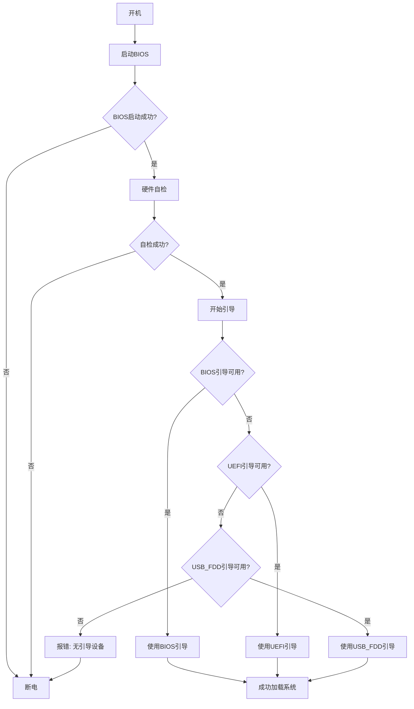

# 02. 开始写引导程序

## 02.1 引导程序介绍

这个引导程序分为三个

1. BIOS
2. UEFI
3. USB_FDD

其中，USB_FDD是针对USB启动盘的引导程序，BIOS和UEFI是针对硬盘的引导程序(其实BIOS也是电脑必须的，没有BIOS，就开不了机，我说的BIOS指的是主板固件)

说一下启动过程


就这样了

## 02.2 开始编写

咱们开始写代码了

新建一个文件`boot.asm`后开始编写代码

```asm
org 0x7c00

times 510-($-$$) db 0
dw 0xaa55

```
解释一下

```asm
org 0x7c00
```
告诉编译器，这个程序从0x7c00开始

```asm
times 510-($-$$) db 0
```
填充0，直到510字节

```asm
dw 0xaa55
```
填充0xaa55，这是引导扇区的标识

然后咱们编译一下

```bat
nasm boot.asm -o boot.bin
dd if=/dev/zero of=disk.img bs=512 count=2880
dd if=boot.bin of=disk.img bs=512 count=1
qemu-system-i386 -hda disk.img
```


