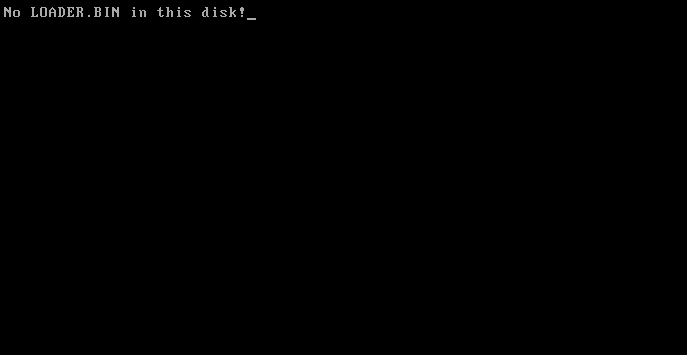

# 03. 开始引导
## 03.1 创建FAT12文件系统

fat12结构看前面1.md文件

这里创建一个fat12文件系统
新建一个文件名为fat12.inc，内容如下：
```asm
    BS_OEMName     db 'system  '    ; 固定的8个字节
    BPB_BytsPerSec dw 512           ; 每扇区固定512个字节
    BPB_SecPerClus db 1             ; 每簇固定1个扇区
    BPB_RsvdSecCnt dw 1             ; MBR固定占用1个扇区
    BPB_NumFATs    db 2             ; FAT12 文件系统固定2个 FAT 表
    BPB_RootEntCnt dw 224           ; FAT12 文件系统中根目录最大224个文件
    BPB_TotSec16   dw 2880          ; 1.44MB磁盘固定2880个扇区
    BPB_Media      db 0xF0          ; 介质描述符，固定为0xF0
    BPB_FATSz16    dw 9             ; 一个FAT表所占的扇区数，FAT12 文件系统固定为9个扇区
    BPB_SecPerTrk  dw 18            ; 每磁道扇区数，固定为18
    BPB_NumHeads   dw 2             ; 磁头数，bximage 的输出告诉我们是2个
    BPB_HiddSec    dd 0             ; 隐藏扇区数，没有
    BPB_TotSec32   dd 0             ; 若之前的 BPB_TotSec16 处没有记录扇区数，则由此记录，如果记录了，这里直接置0即可
    BS_DrvNum      db 0             ; int 13h 调用时所读取的驱动器号，由于只挂在一个软盘所以是0 
    BS_Reserved1   db 0             ; 未使用，预留
    BS_BootSig     db 29h           ; 扩展引导标记
    BS_VolID       dd 0             ; 卷序列号，由于只挂载一个软盘所以为0
    BS_VolLab      db 'SYSTEM     ' ; 卷标，11个字节
    BS_FileSysType db 'FAT12   '    ; 由于是 FAT12 文件系统，所以写入 FAT12 后补齐8个字节

FATSz                   equ 9      ; BPB_FATSz16
RootDirSectors          equ 14     ; 根目录大小
SectorNoOfRootDirectory equ 19     ; 根目录起始扇区
SectorNoOfFAT1          equ 1 ; 第一个FAT表的开始扇区
DeltaSectorNo           equ 17 ; 由于第一个簇不用，所以RootDirSectors要-2再加上根目录区首扇区和偏移才能得到真正的地址，故把RootDirSectors-2封装成一个常量（17）
```

然后，在boot.asm中的`org 0x7c00`后面添加如下代码：
```asm
jmp start
nop

%include 'fat12.inc'
```

返回依然为02-2-4

## 03.2 整理一下文件

新建一个文件，名为boot.inc，内容如下：
```asm
hang:
    jmp hang

; -------------------------
; 清屏并把光标移到(0,0)
; -------------------------
clear_screen:
    mov ah, 0x06    ; 向上滚屏/清屏功能
    mov al, 0x00    ; AL=0 清空整个窗口
    mov bh, 0x07    ; 页面属性（白底灰字，常用默认）
    mov cx, 0x0000  ; 左上 (row=0,col=0)
    mov dx, 0x184F  ; 右下 (row=24,col=79) -> 0x18=行,0x4F=列
    int 0x10
    ret

set_cursor_home:
    mov ah, 0x02
    mov bh, 0x00
    mov dh, 0x00  ; row = 0
    mov dl, 0x00  ; col = 0
    int 0x10
    ret

; -------------------------
; 简单的打印例程
; 使用: mov si, message; call print
; 支持换行 '\n' (0x0A) 和标记数字 '#'<lo><hi>（两个字节）打印16位数
; -------------------------
print:
.print_loop:
    mov al, [si]
    cmp al, 0
    je .done
    cmp al, 0x0A          ; 换行 '\n'
    je .new_line
    cmp al, '#'
    je .print_number
    ; 普通字符
    mov ah, 0x0E
    int 0x10
    inc si
    jmp .print_loop

.new_line:
    ; 输出回车 + 换行，使用 teletype 功能
    mov al, 0x0D
    mov ah, 0x0E
    int 0x10
    mov al, 0x0A
    mov ah, 0x0E
    int 0x10
    inc si
    jmp .print_loop

.print_number:
    inc si               ; 跳过 '#'
    xor ax, ax
    mov al, [si]         ; 低字节
    inc si
    mov ah, [si]         ; 高字节
    inc si
    call print_number16
    jmp .print_loop

.done:
    ret

; -------------------------
; 打印 AX 中的无符号16位十进制数
; 入口: AX = 数值
; 使用 BIOS teletype (AH=0x0E, AL=char)
; -------------------------
print_number16:
    pusha
    mov cx, 0
    mov bx, 10

.convert_loop:
    xor dx, dx
    div bx            ; AX / 10 -> AX=quotient, DX=remainder
    push dx
    inc cx
    cmp ax, 0
    jne .convert_loop

.print_digits:
    pop dx
    add dl, '0'
    mov al, dl
    mov ah, 0x0E
    int 0x10
    loop .print_digits

    popa
    ret
```
然后在boot.asm上删除上面代码，添加如下代码(放在`%include "fat12.inc"`的后面)：
```asm
%include "boot.inc"
```

运行，还是02-2-4

## 03.3 讲一下怎么读盘

接下来，咱们要读磁盘了......但是，没有loader.asm......自己创一个

```asm
org 0x100
%include 'boot.inc'
mov si,message
call print

message db 'hello, world!',0
```
就这一点loader.asm的代码了

回到正题，既然有loader，但需要把loader读到内存中，此时就需要读盘了

此时，一个问题出现了
> 该怎么读盘呢？

这个很简单，在根目录中有一个个32字节的文件结构，其中包含着文件名，所以一个个去读就行

然后咱们计算一下扇区号

`Win+R`,输入`python`,开始计算扇区号

输入以下代码：
```python
# 计算扇区号
# 根目录大小为14扇区，根目录起始扇区为19，根目录区首扇区为17
# 根目录区首扇区 + 根目录大小 = 根目录起始扇区
# 根目录起始扇区 + 文件名长度 = 文件起始扇区
BPB_RsvdSecCnt = 1
BPB_NumFATs = 2
BPB_FATSz16 = 9
BPB_RootEntCnt = 224
BPB_BytsPerSec = 512
x = BPB_RsvdSecCnt + BPB_NumFATs * BPB_FATSz16
y = x + BPB_RootEntCnt * 32 // BPB_BytsPerSec
print(y)
exit()
```
输出：
```cmd
PS D:\11\system\11> python
Python 3.13.7 (tags/v3.13.7:bcee1c3, Aug 14 2025, 14:15:11) [MSC v.1944 64 bit (AMD64)] on win32
Type "help", "copyright", "credits" or "license" for more information.
>>> BPB_RsvdSecCnt = 1
... BPB_NumFATs = 2
... BPB_FATSz16 = 9
... BPB_RootEntCnt = 224
... BPB_BytsPerSec = 512
... 
>>> x = BPB_RsvdSecCnt + BPB_NumFATs * BPB_FATSz16
>>> y = x + BPB_RootEntCnt * 32 // BPB_BytsPerSec
>>> print(y)
33
>>> exit()
```
可以看到，文件起始扇区为33

(补充：还有一个地位，那就是**磁盘读写的最小单位**。当我们说第某某扇区或者是某某号扇区时，默认它从 0 开始，也就是说引导扇区是第 0 个而非第 1 个扇区。)

这样，我们的思路就有了

```text
从第 19 号扇区开始，依次读取每一个扇区，并在读到的扇区中查找 LOADER BIN（loader.bin写入之后的文件名）。如果已经读到第 34 扇区而仍然没有找到 LOADER BIN，那么就默认该磁盘内不存在 loader 。至于怎么找 LOADER BIN，现在没有实现那么多高级算法的条件，只有一个小窍门：根目录区是从某某扇区开始的，而某某扇区的开始位置，一定是 512 的倍数，从而一定是 32 的倍数。那么，我们就只需要遍历开头 11 字节，若不等于 LOADER BIN，则先指回开头，然后加 32，就来到了下一个文件结构。由于某某扇区的开始位置是 32 的倍数，所有文件信息的开始位置也都是 32 的倍数，从而指回开头可以通过位运算实现：32=0b100000，所以只需要与上 0\text{xffff} - (32 - 1) = 0\text{xffe}0，我们就回到了开头
```
那么，怎么读取磁盘呢？

很简单，使用BIOS 0x13中断即可

具体思路是这样的

> 向寄存器依次写入
>
> AH=0x02
>
> al = 待读取的扇区数
>
> ch = 起始扇区所在的柱面
>
> dh = 起始扇区所在的磁头
>
> cl = 起始扇区在柱面内的编号
>
> dl = 驱动器号
>
> es:bx = 存储读取数据的内存地址
>
> 然后调用BIOS 0x13中断即可
>
> 返回值
>
> > FLAGS.CF=0：操作成功，AH=0，AL=成功读入的扇区总数
>
> > FLAGS.CF=1：操作失败，AH=错误码

这里又出现了一堆新名词，柱面、磁头，这又是什么？这是在物理上磁盘的存储结构，具体的结构不需要知道，你只需要知道，每一个磁盘有两面，分别对应上下两个磁头，编号为 0 和 1，而每一面上又被细细分为 80 个柱面（柱面也称磁道），而这里的扇区编号，则是把柱面再一次细分的结果，每一个柱面又被分为 18 个扇区。这一个柱面的 18 个扇区结束后，下一个扇区并不是紧邻着的相邻扇区，而是磁盘对面的那个柱面的第一个扇区。可能有些难理解，说白了，其实就是 0 磁头、0 柱面、18 扇区（第 17 扇区，牢记我们说第某某扇区时是从 0 开始的）的下一个扇区，并不是 0 磁头、1 柱面、1 扇区（第 36 扇区），而是 1 磁头、0 柱面、1 扇区（第 18 扇区）；而 1 磁头、0 柱面、18 扇区的下一个扇区（第 35 扇区），才是 0 磁头、1 柱面、1 扇区（第 36 扇区）。

由于这种寻址方法太过具体，要给的参数太多，现在已经普遍弃用这种指定扇区的方法；由于用到柱面 Cylinder、磁头 Head 和磁头内的扇区编号 Sector，这种方法被称为 CHS 方式。现在一般采用直接指定总的扇区编号的方法，这个扇区编号又有一个名字叫做逻辑区块地址（Logical Block Address），所以这种方法又被称为 LBA 方式。之所以现在突然提到这个，是为了给后面一个方便，以后就可以叫 CHS、LBA 了，更何况 LBA 这个概念我们后面还要用到。从上面的描述也可以大致猜出，为什么 CHS 里 C 排在 H 前面，实话说不查资料谁能想到啊。

还有一个更坑的点，CHS 方式下的第一个扇区是 0 磁头、0 柱面的第 1 扇区，但 LBA 方式下的第一个扇区编号是 0。处理差一问题的痛苦回忆又开始回荡……（笑）

总之，我们现在最大的需求，又变成了把 LBA 方式下的扇区转换成 CHS 的形式。我们先从扇区找到柱面，然后从柱面找到磁头，这一流程大概是这样的：

首先，用 LBA 方式的扇区去除每磁道扇区数，这个东西写在了 BPB 里。前面定义 BPB 用的都是 db、dw、dd，也就是存了一堆数组。其中，BPB_SecPerTrk 表示每个磁道（其实就是柱面）有多少个扇区，它大概长这样：short BPB_SecPerTrk[] = {18};。所以，读取的时候也要读内存地址，也就是类似 *BPB_SecPerTrk 的东西。如果您有一定 C 语言储备，就知道它相当于 BPB_SecPerTrk[0]。这样，商就对应柱面，余数就是这个扇区在柱面内的位置，CHS 的 S 就已经到手了。由于 CHS 方式与 LBA 方式起始扇区的不同，这里需要给余数加 1。

再然后，从柱面找磁头，由上面的描述可以推知，给柱面除以 2，余数就是磁头，商就是对应的那个柱面。举个例子看看，第 36 扇区除以 18，可以知道是第 2 个柱面（这个玩意也是从 0 开始），而它对应的磁头则在正面，隶属 0 磁头；第 35 扇区除以 18，是第 1 个柱面，而它则在背面，隶属 1 磁头。这是因为沿着扇区号走下去时，磁头整体上呈一个 0、1、0、1 交替的态势（具体地说，是一段 0、一段 1 这么交替下去的）。

这样，就可以从 LBA 中一个单独的扇区号，完整地推出 CHS 三个分量的值。那么，我们也就只需要一个 LBA 扇区号就行了，上面的 BIOS 调用中，CH、DH、CL 可以归一。而驱动器号，则明明白白地写在 BS_DrvNum 这个数组里（它也是由 db 定义的），到时候从这个数组取值就行了，DL也可以不要。这样，就只剩下三个必要的参数：缓冲区 ES:BX、读取扇区数 AL 以及起始扇区号。由于起始扇区号可能很大，我们把它分配给 AX，原先读取扇区数的位置就随便挑个东西给了，就 CL 吧。

AH返回值，我们并不需要，我们只需要知道cf是否为0就行

接下来写代码

等一下，还有一点来补充

0x13的另一个用途
> 向寄存器依次写入
>
> AH = 0x00
>
> DL = 驱动器号
>
> 然后调用BIOS 0x13中断即可
>
> 返回值
>
> > FLAGS.CF=0：操作成功，AH=0，AL=驱动器类型
>
> > FLAGS.CF=1：操作失败，AH=错误码


## 03.4 读取磁盘
往dp.inc中添加如下代码：

```asm
ReadSector:
    push bp
    mov bp, sp
    sub esp, 2
    mov byte [bp - 2], cl
    push bx
    mov bl, [BPB_SecPerTrk]
    div bl
    inc ah
    mov cl, ah
    mov dh, al
    shr al, 1
    mov ch, al
    and dh, 1
    pop bx
    mov dl, [BS_DrvNum]
    mov ah, 0x00    ; 修改这里，重置磁盘系统
    int 0x13
.GoOnReading:
    mov ah, 2
    mov al, byte [bp - 2]
    int 0x13
    jc .GoOnReading
    add esp, 2
    pop bp
    ret

```

然后，在boot.asm中添加如下代码(在`%include "boot.inc"`之前)：

```asm
%include "dp.inc"
```

接下来，在dp.inc中添加如下代码(结尾处)：

```asm
BaseOfStack equ 0x7c00
BaseOfLoader equ 0x9000
OffsetOfLoader equ 0x100 ;这里是loader.bin的内存地址，实际上应该根据loader.asm上的头org来输入
LoaderFileName db "LOADER  BIN", 0 ; loader的文件名

wSectorNo dw 0
wRootDirSizeForLoop dw RootDirSectors
RootDirOffset equ 0
```

然后把boot.asm给改一下(下面是完整代码)：

```asm
org 0x7c00

jmp start
nop

%include "boot.inc"
%include "dp.inc"
%include "fat12.inc"

start:
    call clear_screen
    call set_cursor_home
    mov ax, cs
    mov ds, ax
    mov es, ax
    mov ss, ax
    ;设置栈顶
    mov sp, BaseOfStack
    ;复位
    xor ah,ah
    xor dl,dl
    int 0x13
    mov word [wSectorNo], SectorNoOfRootDirectory
Search_Root_DIR:
    cmp word [wRootDirSizeForLoop], 0
    jz  No_LoaderBin
    dec word [wRootDirSizeForLoop]
    mov ax, RootDirSectors
    mov es, ax
    mov bx, RootDirOffset
    mov ax, [wSectorNo]
    mov cl, 1
    call ReadSector
    mov si, LoaderFileName 
    mov di, OffsetOfLoader
    cld
    mov dx , 0x10
Search_For_Loader:
    cmp dx, 0
    jz Goto_Next_Sector
    dec dx
    mov cx, 11
Cmp_filename:
    cmp cx, 0
    jz FILENAME_FOUND
    dec cx
    lodsb
    cmp al, byte [es:di]
    jz GO_ON
    jmp DIFFERENT
GO_ON:
    inc di
    jmp Cmp_filename
DIFFERENT:
    and byte [es:di], 0x0
    jmp Search_For_Loader

Goto_Next_Sector:
    mov si, Message
    call print
    jmp $
FILENAME_FOUND:
    jmp $
No_LoaderBin:
    mov si, Message
    call print
    jmp $


Message db "No LOADER.BIN in this disk!"

times 510-($-$$) db 0
dw 0xaa55

```

这样就可以了

运行一下，如下图



可以看到也是运行成功了

然后用`dd`新建一个disk.img文件，然后输入`dd if=boot.img of=disk.img bs=512 count=1`

然后编译一下loader.asm

然后就需要用到`edimg`了，输入`edimg imgin:disk.img copy from:loader.bin to:@: imgout:disk.img`

输出如下


## 03.5 加载Loader

咱们读取到后，先获取一下FAT项，这里写一下获取FAT项的函数：
(dp.inc .GoOnReading函数后面)
```asm
GetFATEntry:
    push es
    push bx
    push ax ; 都会用到，push一下
    mov ax, BaseOfLoader ; 获取Loader的基址
    sub ax, 0x100 ; 留出4KB空间
    mov es, ax ; 此处就是缓冲区的基址
    pop ax ; ax我们就用不到了
    mov byte [bOdd], 0 ; 设置bOdd的初值
    mov bx, 3
    mul bx ; dx:ax=ax * 3（mul的第二重用法：如有进位，高位将放入dx）
    mov bx, 2
    div bx ; dx:ax / 2 -> dx：余数 ax：商
; 此处* 1.5的原因是，每个FAT项实际占用的是1.5扇区，所以要把表项 * 1.5
    cmp dx, 0 ; 没有余数
    jz LABEL_EVEN
    mov byte [bOdd], 1 ; 那就是奇数了
LABEL_EVEN:
    ; 此时ax中应当已经存储了待查找FAT相对于FAT表的偏移，下面我们借此来查找它的扇区号
    xor dx, dx ; dx置0
    mov bx, [BPB_BytsPerSec]
    div bx ; dx:ax / 512 -> ax：商（扇区号）dx：余数（扇区内偏移）
    push dx ; 暂存dx，后面要用
    mov bx, 0 ; es:bx：(BaseOfLoader - 4KB):0
    add ax, SectorNoOfFAT1 ; 实际扇区号
    mov cl, 2
    call ReadSector ; 直接读2个扇区，避免出现跨扇区FAT项出现bug
    pop dx ; 由于ReadSector未保存dx的值所以这里保存一下
    add bx, dx ; 现在扇区内容在内存中，bx+=dx，即是真正的FAT项
    mov ax, [es:bx] ; 读取之

    cmp byte [bOdd], 1
    jnz EVEN_2 ; 是偶数，则进入LABEL_EVEN_2
    shr ax, 4 ; 高12位为真正的FAT项
EVEN_2:
    and ax, 0xFFF ; 只保留低4位
GET_FAT_ENRY_OK: ; 胜利执行
    pop bx
    pop es ; 恢复堆栈
    ret
```

最后就是跳转了
```asm
FILENAME_FOUND:
    mov ax, RootDirSectors ; 将ax置为根目录首扇区（19）
    and di, 0xFFE0 ; 将di设置到此文件块开头
    add di, 0x1A ; 此时的di指向Loader的FAT号
    mov cx, word [es:di] ; 获得该扇区的FAT号
    push cx ; 将FAT号暂存
    add cx, ax ; +根目录首扇区
    add cx, DeltaSectorNo ; 获得真正的地址
    mov ax, BaseOfLoader
    mov es, ax
    mov bx, OffsetOfLoader ; es:bx：读取扇区的缓冲区地址
    mov ax, cx ; ax：起始扇区号
GOON_LOADING_FILE: ; 加载文件
    push ax
    push bx
    mov ah, 0xE ; AH=0Eh：显示单个字符
    mov al, '.' ; AL：字符内容
    mov bl, 0xF ; BL：显示属性
; 还有BH：页码，此处不管
    int 0x10 ; 显示此字符
    pop bx
    pop ax ; 上面几行的整体作用：在屏幕上打印一个点

    mov cl, 1
    call ReadSector ; 读取Loader第一个扇区
    pop ax ; 加载FAT号
    call GetFATEntry ; 加载FAT项
    cmp ax, 0xFFF
    jz FILE_LOADED ; 若此项=0xFFF，代表文件结束，直接跳入Loader
    push ax ; 重新存储FAT号，但此时的FAT号已经是下一个FAT了
    mov dx, RootDirSectors
    add ax, dx ; +根目录首扇区
    add ax, DeltaSectorNo ; 获取真实地址
    add bx, [BPB_BytsPerSec] ; 将bx指向下一个扇区开头
    jmp GOON_LOADING_FILE ; 加载下一个扇区
FILE_LOADED:
    jmp BaseOfLoader:OffsetOfLoader ; 跳入Loader！
```

运行一下，如下图


OK，明天再搞保护模式

