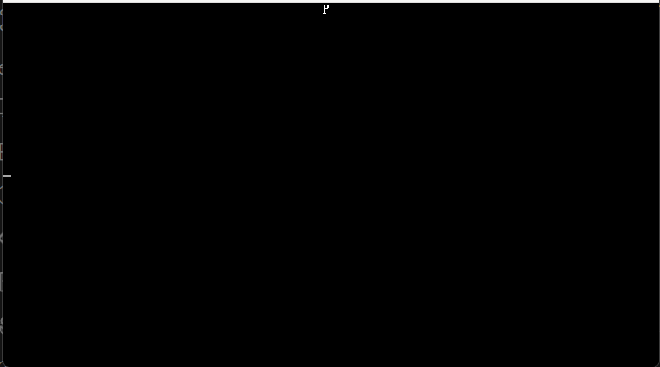

# 04. 进入保护模式
## 04.1 先把之前的代码放出来

由于之前的代码edimg无法写入，于是又重写了一下

现在的boot.asm代码如下

```asm
org 0x7c00 ; 告诉编译器程序将装载至0x7c00处

BaseOfStack             equ 0x7c00 ; 栈的基址
BaseOfLoader            equ 0x9000 ; Loader的基址
OffsetOfLoader          equ 0x0100 ; Loader的偏移

    jmp short LABEL_START
    nop ; BS_JMPBoot 由于要三个字节而jmp到LABEL_START只有两个字节 所以加一个nop
%include "fat12.inc"

LABEL_START:
    mov ax, cs
    mov ds, ax
    mov es, ax ; 将ds es设置为cs的值（因为此时字符串和变量等存在代码段内）
    mov ss, ax ; 将堆栈段也初始化至cs
    mov sp, BaseOfStack ; 设置栈顶

    mov ax, 0x0600 ; AH=06h：向上滚屏，AL=00h：清空窗口
    mov bx, 0x0700 ; 空白区域缺省属性
    mov cx, 0 ; 左上：(0, 0)
    mov dx, 0x184f ; 右下：(80, 25)
    int 0x10 ; 执行

    xor ah, ah ; 复位
    xor dl, dl
    int 0x13 ; 执行软驱复位

    mov word [wSectorNo], SectorNoOfRootDirectory ; 开始查找，将当前读到的扇区数记为根目录区的开始扇区（19）
LABEL_SEARCH_IN_ROOT_DIR_BEGIN:
    cmp word [wRootDirSizeForLoop], 0 ; 将剩余的根目录区扇区数与0比较
    jz LABEL_NO_LOADERBIN ; 相等，不存在Loader，进行善后
    dec word [wRootDirSizeForLoop] ; 减去一个扇区
    mov ax, BaseOfLoader
    mov es, ax
    mov bx, OffsetOfLoader ; 将es:bx设置为BaseOfLoader:OffsetOfLoader，暂且使用Loader所占的内存空间存放根目录区
    mov ax, [wSectorNo] ; 起始扇区：当前读到的扇区数（废话）
    mov cl, 1 ; 读取一个扇区
    call ReadSector ; 读入

    mov si, LoaderFileName ; 为比对做准备，此处是将ds:si设为Loader文件名
    mov di, OffsetOfLoader ; 为比对做准备，此处是将es:di设为Loader偏移量（即根目录区中的首个文件块）
    cld ; FLAGS.DF=0，即执行lodsb/lodsw/lodsd后，si自动增加
    mov dx, 0x10 ; 共16个文件块（代表一个扇区，因为一个文件块32字节，16个文件块正好一个扇区）
LABEL_SEARCH_FOR_LOADERBIN:
    cmp dx, 0 ; 将dx与0比较
    jz LABEL_GOTO_NEXT_SECTOR_IN_ROOT_DIR ; 继续前进一个扇区
    dec dx ; 否则将dx减1
    mov cx, 11 ; 文件名共11字节
LABEL_CMP_FILENAME: ; 比对文件名
    cmp cx, 0 ; 将cx与0比较
    jz LABEL_FILENAME_FOUND ; 若相等，说明文件名完全一致，表示找到，进行找到后的处理
    dec cx ; cx减1，表示读取1个字符
    lodsb ; 将ds:si的内容置入al，si加1
    cmp al, byte [es:di] ; 此字符与LOADER  BIN中的当前字符相等吗？
    jz LABEL_GO_ON ; 下一个文件名字符
    jmp LABEL_DIFFERENT ; 下一个文件块
LABEL_GO_ON:
    inc di ; di加1，即下一个字符
    jmp LABEL_CMP_FILENAME ; 继续比较

LABEL_DIFFERENT:
    and di, 0xFFE0 ; 指向该文件块开头
    add di, 0x20 ; 跳过32字节，即指向下一个文件块开头
    mov si, LoaderFileName ; 重置ds:si
    jmp LABEL_SEARCH_FOR_LOADERBIN ; 由于要重新设置一些东西，所以回到查找Loader循环的开头

LABEL_GOTO_NEXT_SECTOR_IN_ROOT_DIR:
    add word [wSectorNo], 1 ; 下一个扇区
    jmp LABEL_SEARCH_IN_ROOT_DIR_BEGIN ; 重新执行主循环

LABEL_NO_LOADERBIN: ; 若找不到loader.bin则到这里
    mov si, Message2
    call print; 显示No LOADER
    jmp $

LABEL_FILENAME_FOUND:
    mov ax, RootDirSectors ; 将ax置为根目录首扇区（19）
    and di, 0xFFE0 ; 将di设置到此文件块开头
    add di, 0x1A ; 此时的di指向Loader的FAT号
    mov cx, word [es:di] ; 获得该扇区的FAT号
    push cx ; 将FAT号暂存
    add cx, ax ; +根目录首扇区
    add cx, DeltaSectorNo ; 获得真正的地址
    mov ax, BaseOfLoader
    mov es, ax
    mov bx, OffsetOfLoader ; es:bx：读取扇区的缓冲区地址
    mov ax, cx ; ax：起始扇区号

LABEL_GOON_LOADING_FILE: ; 加载文件
    push ax
    push bx
;    mov ah, 0x0E ; AH=0Eh：显示单个字符
;    mov al, '.' ; AL：字符内容
;    mov bl, 0x0F ; BL：显示属性
; 还有BH：页码，此处不管
;    int 0x10 ; 显示此字符
    pop bx
    pop ax ; 上面几行的整体作用：在屏幕上打印一个点

    mov cl, 1
    call ReadSector ; 读取Loader第一个扇区
    pop ax ; 加载FAT号
    call GetFATEntry ; 加载FAT项
    cmp ax, 0xFFF
    jz LABEL_FILE_LOADED ; 若此项=0xFFF，代表文件结束，直接跳入Loader
    push ax ; 重新存储FAT号，但此时的FAT号已经是下一个FAT了
    mov dx, RootDirSectors
    add ax, dx ; +根目录首扇区
    add ax, DeltaSectorNo ; 获取真实地址
    add bx, [BPB_BytsPerSec] ; 将bx指向下一个扇区开头
    jmp LABEL_GOON_LOADING_FILE ; 加载下一个扇区

LABEL_FILE_LOADED:
    jmp BaseOfLoader:OffsetOfLoader ; 跳入Loader！

wRootDirSizeForLoop dw RootDirSectors ; 查找loader的循环中将会用到
wSectorNo           dw 0              ; 用于保存当前扇区数
bOdd                db 0              ; 这个其实是下一节的东西，不过先放在这也不是不行

; 修改字符串定义，确保正确终止
LoaderFileName      db "LOADER  BIN", 0 ; loader的文件名
Message2            db "No LOADER", 0   ; 显示没有Loader，确保有终止符

print:
    pusha               ; 保存所有寄存器
    mov ax, cs          ; 设置 ES:BP 指向字符串
    mov es, ax
    mov bp, si          ; BP 指向字符串地址
    
    ; 计算字符串长度
    mov cx, 0           ; 长度计数器
.calc_length:
    cmp byte [si], 0    ; 检查是否到达字符串末尾
    je .display         ; 如果是，跳转到显示部分
    inc cx              ; 增加长度计数
    inc si              ; 移动到下一个字符
    jmp .calc_length    ; 继续计算
    
.display:
    mov ax, 0x1301      ; AH=13h（显示字符串），AL=01h（光标移动，字符串包含字符和属性）
    mov bx, 0x0007      ; BH=0（页码），BL=07h（浅灰色字符）
    ; CX 已经包含字符串长度
    mov dx, 0           ; DH=0（行），DL=0（列）- 从左上角开始
    int 0x10            ; 调用 BIOS 显示字符串
    
    popa                ; 恢复所有寄存器
    ret                 ; 返回

ReadSector:
    push bp
    mov bp, sp
    sub esp, 2 ; 空出两个字节存放待读扇区数（因为cl在调用BIOS时要用）

    mov byte [bp-2], cl
    push bx ; 这里临时用一下bx
    mov bl, [BPB_SecPerTrk]
    div bl ; 执行完后，ax将被除以bl（每磁道扇区数），运算结束后商位于al，余数位于ah，那么al代表的就是总磁道个数（下取整），ah代表的是剩余没除开的扇区数
    inc ah ; +1表示起始扇区（这个才和BIOS中的起始扇区一个意思，是读入开始的第一个扇区）
    mov cl, ah ; 按照BIOS标准置入cl
    mov dh, al ; 用dh暂存位于哪个磁道
    shr al, 1 ; 每个磁道两个磁头，除以2可得真正的柱面编号
    mov ch, al ; 按照BIOS标准置入ch
    and dh, 1 ; 对磁道模2取余，可得位于哪个磁头，结果已经置入dh
    pop bx ; 将bx弹出
    mov dl, [BS_DrvNum] ; 将驱动器号存入dl
.GoOnReading: ; 万事俱备，只欠读取！
    mov ah, 2 ; 读盘
    mov al, byte [bp-2] ; 将之前存入的待读扇区数取出来
    int 0x13 ; 执行读盘操作
    jc .GoOnReading ; 如发生错误就继续读，否则进入下面的流程

    add esp, 2
    pop bp ; 恢复堆栈

    ret

GetFATEntry:
    push es
    push bx
    push ax ; 都会用到，push一下
    mov ax, BaseOfLoader ; 获取Loader的基址
    sub ax, 0x0100 ; 留出4KB空间
    mov es, ax ; 此处就是缓冲区的基址
    pop ax ; ax我们就用不到了
    mov byte [bOdd], 0 ; 设置bOdd的初值
    mov bx, 3
    mul bx ; dx:ax=ax * 3（mul的第二重用法：如有进位，高位将放入dx）
    mov bx, 2
    div bx ; dx:ax / 2 -> dx：余数 ax：商
; 此处* 1.5的原因是，每个FAT项实际占用的是1.5扇区，所以要把表项 * 1.5
    cmp dx, 0 ; 没有余数
    jz LABEL_EVEN
    mov byte [bOdd], 1 ; 那就是奇数了
LABEL_EVEN:
    ; 此时ax中应当已经存储了待查找FAT相对于FAT表的偏移，下面我们借此来查找它的扇区号
    xor dx, dx ; dx置0
    mov bx, [BPB_BytsPerSec]
    div bx ; dx:ax / 512 -> ax：商（扇区号）dx：余数（扇区内偏移）
    push dx ; 暂存dx，后面要用
    mov bx, 0 ; es:bx：(BaseOfLoader - 4KB):0
    add ax, SectorNoOfFAT1 ; 实际扇区号
    mov cl, 2
    call ReadSector ; 直接读2个扇区，避免出现跨扇区FAT项出现bug
    pop dx ; 由于ReadSector未保存dx的值所以这里保存一下
    add bx, dx ; 现在扇区内容在内存中，bx+=dx，即是真正的FAT项
    mov ax, [es:bx] ; 读取之

    cmp byte [bOdd], 1
    jnz LABEL_EVEN_2 ; 是偶数，则进入LABEL_EVEN_2
    shr ax, 4 ; 高4位为真正的FAT项
LABEL_EVEN_2:
    and ax, 0xFFF ; 只保留低4位

LABEL_GET_FAT_ENRY_OK: ; 胜利执行
    pop bx
    pop es ; 恢复堆栈
    ret

times 510 - ($ - $$) db 0
db 0x55, 0xAA ; 确保最后两个字节是0x55AA
```

然后根据这个，把loader也给改一下

```asm
    org 0x100 ; 告诉编译器程序将装载至0x100处

BaseOfStack                 equ 0100h ; 栈的基址
BaseOfKernelFile            equ 08000h ; Kernel的基址
OffsetOfKernelFile          equ 0h  ; Kernel的偏移

    jmp LABEL_START

%include "fat12.inc"

LABEL_START:
    mov ax, cs
    mov ds, ax
    mov es, ax ; 将ds es设置为cs的值（因为此时字符串和变量等存在代码段内）
    mov ss, ax ; 将堆栈段也初始化至cs
    mov sp, BaseOfStack ; 设置栈顶


    mov word [wSectorNo], SectorNoOfRootDirectory ; 开始查找，将当前读到的扇区数记为根目录区的开始扇区（19）
    xor ah, ah ; 复位
    xor dl, dl
    int 13h ; 执行软驱复位
LABEL_SEARCH_IN_ROOT_DIR_BEGIN:
    cmp word [wRootDirSizeForLoop], 0 ; 将剩余的根目录区扇区数与0比较
    jz LABEL_NO_KERNELBIN ; 相等，不存在Kernel，进行善后
    dec word [wRootDirSizeForLoop] ; 减去一个扇区
    mov ax, BaseOfKernelFile
    mov es, ax
    mov bx, OffsetOfKernelFile ; 将es:bx设置为BaseOfKernel:OffsetOfKernel，暂且使用Kernel所占的内存空间存放根目录区
    mov ax, [wSectorNo] ; 起始扇区：当前读到的扇区数（废话）
    mov cl, 1 ; 读取一个扇区
    call ReadSector ; 读入

    mov si, KernelFileName ; 为比对做准备，此处是将ds:si设为Kernel文件名
    mov di, OffsetOfKernelFile ; 为比对做准备，此处是将es:di设为Kernel偏移量（即根目录区中的首个文件块）
    cld ; FLAGS.DF=0，即执行lodsb/lodsw/lodsd后，si自动增加
    mov dx, 10h ; 共16个文件块（代表一个扇区，因为一个文件块32字节，16个文件块正好一个扇区）
LABEL_SEARCH_FOR_KERNELBIN:
    cmp dx, 0 ; 将dx与0比较
    jz LABEL_GOTO_NEXT_SECTOR_IN_ROOT_DIR ; 继续前进一个扇区
    dec dx ; 否则将dx减1
    mov cx, 11 ; 文件名共11字节
LABEL_CMP_FILENAME: ; 比对文件名
    cmp cx, 0 ; 将cx与0比较
    jz LABEL_FILENAME_FOUND ; 若相等，说明文件名完全一致，表示找到，进行找到后的处理
    dec cx ; cx减1，表示读取1个字符
    lodsb ; 将ds:si的内容置入al，si加1
    cmp al, byte [es:di] ; 此字符与LOADER  BIN中的当前字符相等吗？
    jz LABEL_GO_ON ; 下一个文件名字符
    jmp LABEL_DIFFERENT ; 下一个文件块
LABEL_GO_ON:
    inc di ; di加1，即下一个字符
    jmp LABEL_CMP_FILENAME ; 继续比较

LABEL_DIFFERENT:
    and di, 0FFE0h ; 指向该文件块开头
    add di, 20h ; 跳过32字节，即指向下一个文件块开头
    mov si, KernelFileName ; 重置ds:si
    jmp LABEL_SEARCH_FOR_KERNELBIN ; 由于要重新设置一些东西，所以回到查找Kernel循环的开头

LABEL_GOTO_NEXT_SECTOR_IN_ROOT_DIR:
    add word [wSectorNo], 1 ; 下一个扇区
    jmp LABEL_SEARCH_IN_ROOT_DIR_BEGIN ; 重新执行主循环

LABEL_NO_KERNELBIN: ; 若找不到kernel.bin则到这里
    mov si, Message2
    call print ; 显示No KERNEL
    jmp $

LABEL_FILENAME_FOUND:
    mov ax, RootDirSectors ; 将ax置为根目录首扇区（19）
    and di, 0FFF0h ; 将di设置到此文件块开头

    push eax
    mov eax, [es:di + 01Ch]
    mov dword [dwKernelSize], eax
    pop eax

    add di, 01Ah ; 此时的di指向Kernel的FAT号
    mov cx, word [es:di] ; 获得该扇区的FAT号
    push cx ; 将FAT号暂存
    add cx, ax ; +根目录首扇区
    add cx, DeltaSectorNo ; 获得真正的地址
    mov ax, BaseOfKernelFile
    mov es, ax
    mov bx, OffsetOfKernelFile ; es:bx：读取扇区的缓冲区地址
    mov ax, cx ; ax：起始扇区号

LABEL_GOON_LOADING_FILE: ; 加载文件
    push ax
    push bx
    pop bx
    pop ax ; 上面几行的整体作用：在屏幕上打印一个点

    mov cl, 1
    call ReadSector ; 读取Kernel第一个扇区
    pop ax ; 加载FAT号
    call GetFATEntry ; 加载FAT项
    cmp ax, 0FFFh
    jz LABEL_FILE_LOADED ; 若此项=0FFF，代表文件结束，直接跳入Kernel
    push ax ; 重新存储FAT号，但此时的FAT号已经是下一个FAT了
    mov dx, RootDirSectors
    add ax, dx ; +根目录首扇区
    add ax, DeltaSectorNo ; 获取真实地址
    add bx, [BPB_BytsPerSec] ; 将bx指向下一个扇区开头
    jmp LABEL_GOON_LOADING_FILE ; 加载下一个扇区

LABEL_FILE_LOADED:
    call KillMotor ; 关闭软驱马达

    jmp $ ; 暂时停在此处

dwKernelSize        dd 0              ; Kernel大小
wRootDirSizeForLoop dw RootDirSectors ; 查找Kernel的循环中将会用到
wSectorNo           dw 0              ; 用于保存当前扇区数
bOdd                db 0              ; 这个其实是下一节的东西，不过先放在这也不是不行

KernelFileName      db "KERNEL  BIN", 0 ; Kernel的文件名

Message2            db "No KERNEL" ; 显示没有Kernel

print:
    pusha               ; 保存所有寄存器
    mov ax, cs          ; 设置 ES:BP 指向字符串
    mov es, ax
    mov bp, si          ; BP 指向字符串地址
    
    ; 计算字符串长度
    mov cx, 0           ; 长度计数器
.calc_length:
    cmp byte [si], 0    ; 检查是否到达字符串末尾
    je .display         ; 如果是，跳转到显示部分
    inc cx              ; 增加长度计数
    inc si              ; 移动到下一个字符
    jmp .calc_length    ; 继续计算
    
.display:
    mov ax, 0x1301      ; AH=13h（显示字符串），AL=01h（光标移动，字符串包含字符和属性）
    mov bx, 0x0007      ; BH=0（页码），BL=07h（浅灰色字符）
    ; CX 已经包含字符串长度
    mov dx, 0           ; DH=0（行），DL=0（列）- 从左上角开始
    int 0x10            ; 调用 BIOS 显示字符串
    
    popa                ; 恢复所有寄存器
    ret                 ; 返回

ReadSector:
    push bp
    mov bp, sp
    sub esp, 2 ; 空出两个字节存放待读扇区数（因为cl在调用BIOS时要用）

    mov byte [bp-2], cl
    push bx ; 这里临时用一下bx
    mov bl, [BPB_SecPerTrk]
    div bl ; 执行完后，ax将被除以bl（每磁道扇区数），运算结束后商位于al，余数位于ah，那么al代表的就是总磁道个数（下取整），ah代表的是剩余没除开的扇区数
    inc ah ; +1表示起始扇区（这个才和BIOS中的起始扇区一个意思，是读入开始的第一个扇区）
    mov cl, ah ; 按照BIOS标准置入cl
    mov dh, al ; 用dh暂存位于哪个磁道
    shr al, 1 ; 每个磁道两个磁头，除以2可得真正的柱面编号
    mov ch, al ; 按照BIOS标准置入ch
    and dh, 1 ; 对磁道模2取余，可得位于哪个磁头，结果已经置入dh
    pop bx ; 将bx弹出
    mov dl, [BS_DrvNum] ; 将驱动器号存入dl
.GoOnReading: ; 万事俱备，只欠读取！
    mov ah, 2 ; 读盘
    mov al, byte [bp-2] ; 将之前存入的待读扇区数取出来
    int 13h ; 执行读盘操作
    jc .GoOnReading ; 如发生错误就继续读，否则进入下面的流程

    add esp, 2
    pop bp ; 恢复堆栈

    ret

GetFATEntry:
    push es
    push bx
    push ax ; 都会用到，push一下
    mov ax, BaseOfKernelFile ; 获取Kernel的基址
    sub ax, 0100h ; 留出4KB空间
    mov es, ax ; 此处就是缓冲区的基址
    pop ax ; ax我们就用不到了
    mov byte [bOdd], 0 ; 设置bOdd的初值
    mov bx, 3
    mul bx ; dx:ax=ax * 3（mul的第二重用法：如有进位，高位将放入dx）
    mov bx, 2
    div bx ; dx:ax / 2 -> dx：余数 ax：商
; 此处* 1.5的原因是，每个FAT项实际占用的是1.5扇区，所以要把表项 * 1.5
    cmp dx, 0 ; 没有余数
    jz LABEL_EVEN
    mov byte [bOdd], 1 ; 那就是奇数了
LABEL_EVEN:
    ; 此时ax中应当已经存储了待查找FAT相对于FAT表的偏移，下面我们借此来查找它的扇区号
    xor dx, dx ; dx置0
    mov bx, [BPB_BytsPerSec]
    div bx ; dx:ax / 512 -> ax：商（扇区号）dx：余数（扇区内偏移）
    push dx ; 暂存dx，后面要用
    mov bx, 0 ; es:bx：(BaseOfKernelFile - 4KB):0
    add ax, SectorNoOfFAT1 ; 实际扇区号
    mov cl, 2
    call ReadSector ; 直接读2个扇区，避免出现跨扇区FAT项出现bug
    pop dx ; 由于ReadSector未保存dx的值所以这里保存一下
    add bx, dx ; 现在扇区内容在内存中，bx+=dx，即是真正的FAT项
    mov ax, [es:bx] ; 读取之

    cmp byte [bOdd], 1
    jnz LABEL_EVEN_2 ; 是偶数，则进入LABEL_EVEN_2
    shr ax, 4 ; 高4位为真正的FAT项
LABEL_EVEN_2:
    and ax, 0FFFh ; 只保留低4位

LABEL_GET_FAT_ENRY_OK: ; 胜利执行
    pop bx
    pop es ; 恢复堆栈
    ret

KillMotor: ; 关闭软驱马达
    push dx
    mov dx, 03F2h ; 软驱端口
    mov al, 0 ; 软盘驱动器：0，复位软盘驱动器，禁止DMA中断，关闭软驱马达
    out dx, al ; 执行
    pop dx
    ret
```

fat12.inc看3.md

## 04.2 讲一下保护模式

保护模式是BIOS的一种模式(简称PM)，它允许c语言的bin文件(俗称：1MB内存)，并且能够进入32位模式。缺点是不能使用BIOS中断

实模式(简称RM)，是BIOS默认启动的模式，不能使用超过1MB内存，并且只能使用16位模式

然后就是GDT和IDT了

GDT：全局描述符表，用来存储段描述符，段描述符用来存储段基址和段限长，段基址和段限长是段寄存器

IDT：中断描述符表，用来存储中断描述符，中断描述符用来存储中断处理程序的入口地址

当然，GDT和IDT是后天的内容，现在我们只需要知道它们的存在即可

然后就是A20地址线了，它用来扩展内存，使得内存能够超过1MB，也可以用A20切换到保护模式

OK，讲完就谈谈怎么进入保护模式

## 04.3 进入保护模式

内核程序(kernel.asm):
```asm
[section .text]

global _start

_start: ; 此处假设gs仍指向显存
    mov ah, 0xF
    mov al, 'K'
    mov [gs:((80 * 1 + 39) * 2)], ax ; 第1行正中央，白色K
    jmp $ ; 死循环
```

这个的编译命令：
```bash
nasm -f elf -o kernel.o kernel.asm
i686-elf-ld -s -Ttext 0x100000 -o kernel.bin kernel.o
```

写入命令也要改一下
```bash
edimg imgin:a.img copy from:loader.bin to:@: copy from:kernel.bin to:@: imgout:a.img
```
然后，咱们新建一个pm.inc，往里面写这些代码：

```asm
DA_32       EQU 4000h
DA_LIMIT_4K EQU 8000h

DA_DPL0     EQU 00h
DA_DPL1     EQU 20h
DA_DPL2     EQU 40h
DA_DPL3     EQU 60h

DA_DR       EQU 90h
DA_DRW      EQU 92h
DA_DRWA     EQU 93h
DA_C        EQU 98h
DA_CR       EQU 9Ah
DA_CCO      EQU 9Ch
DA_CCOR     EQU 9Eh

DA_LDT      EQU 82h
DA_TaskGate EQU 85h
DA_386TSS   EQU 89h
DA_386CGate EQU 8Ch
DA_386IGate EQU 8Eh
DA_386TGate EQU 8Fh

SA_RPL0     EQU 0
SA_RPL1     EQU 1
SA_RPL2     EQU 2
SA_RPL3     EQU 3

SA_TIG      EQU 0
SA_TIL      EQU 4

PG_P        EQU 1
PG_RWR      EQU 0
PG_RWW      EQU 2
PG_USS      EQU 0
PG_USU      EQU 4

%macro Descriptor 3
    dw %2 & 0FFFFh
    dw %1 & 0FFFFh
    db (%1 >> 16) & 0FFh
    dw ((%2 >> 8) & 0F00h) | (%3 & 0F0FFh)
    db (%1 >> 24) & 0FFh
%endmacro

%macro Gate 4
    dw (%2 & 0FFFFh)
    dw %1
    dw (%3 & 1Fh) | ((%4 << 8) & 0FF00h)
    dw ((%2 >> 16) & 0FFFFh)
%endmacro
```

然后，在loader.asm中添加以下代码(Label_start前面)：
```asm
%include "pm.inc"

LABEL_GDT:          Descriptor 0,            0, 0                            ; 占位用描述符
LABEL_DESC_FLAT_C:  Descriptor 0,      0fffffh, DA_C | DA_32 | DA_LIMIT_4K   ; 32位代码段，平坦内存
LABEL_DESC_FLAT_RW: Descriptor 0,      0fffffh, DA_DRW | DA_32 | DA_LIMIT_4K ; 32位数据段，平坦内存
LABEL_DESC_VIDEO:   Descriptor 0B8000h, 0ffffh, DA_DRW | DA_DPL3             ; 文本模式显存，后面用不到了

GdtLen equ $ - LABEL_GDT                                                    ; GDT的长度
GdtPtr dw GdtLen - 1                                                        ; gdtr寄存器，先放置长度
       dd BaseOfLoaderPhyAddr + LABEL_GDT                                   ; 保护模式使用线性地址，因此需要加上程序装载位置的物理地址（BaseOfLoaderPhyAddr）

SelectorFlatC       equ LABEL_DESC_FLAT_C  - LABEL_GDT                      ; 代码段选择子
SelectorFlatRW      equ LABEL_DESC_FLAT_RW - LABEL_GDT                      ; 数据段选择子
SelectorVideo       equ LABEL_DESC_VIDEO   - LABEL_GDT + SA_RPL3            ; 文本模式显存选择子
```

然后，在代码最后添加以下代码：
```asm
[section .s32]
align 32
[bits 32]
LABEL_PM_START:
    mov ax, SelectorVideo ; 按照保护模式的规矩来
    mov gs, ax            ; 把选择子装入gs

    mov ah, 0Fh
    mov al, 'P'
    mov [gs:((80 * 0 + 39) * 2)], ax ; 这一部分写入显存是通用的
    jmp $
```

接下来，就是进入保护模式了

```asm
LABEL_FILE_LOADED:
    call KillMotor ; 关闭软驱马达

    lgdt [GdtPtr] ; 下面开始进入保护模式

    cli ; 关中断

    in al, 92h ; 使用A20快速门开启A20
    or al, 00000010b
    out 92h, al

    mov eax, cr0
    or eax, 1 ; 置位PE位
    mov cr0, eax

    jmp dword SelectorFlatC:(BaseOfLoaderPhyAddr + LABEL_PM_START) ; 真正进入保护模式
```



## 04.4 整理一下

新建一个load.inc，往里面写这些代码：
```asm
BaseOfLoader            equ 0x9000 ; Loader的基址
OffsetOfLoader          equ 0x100  ; Loader的偏移

BaseOfLoaderPhyAddr     equ BaseOfLoader * 10h ; Loader被装载到的物理地址

BaseOfKernelFile            equ 0x8000 ; Kernel的基址
OffsetOfKernelFile          equ 0x0  ; Kernel的偏移
```

然后，在boot.asm和loader.asm中添加以下代码：
```asm
%include "load.inc"
```

运行依然04-3-1

## 04.5 重新放置内核并跳转

首先，咱们要实现memcpy函数，根据gcc官方文档......代码应该是这个样子
```c
void* memcpy(void* dest, const void* src, size_t n)
{
    const char* s = src;
    char* d = dest;
    for (; n != 0; n--) *d++ = *s++;
    return dest;
}
```
就简单的几行代码，但是，由于我们使用的是汇编，所以，实现memcpy函数稍微复杂一些，代码如下：
```asm
[section .s32]
align 32
[bits 32]
LABEL_PM_START:
    mov ax, SelectorVideo ; 按照保护模式的规矩来
    mov gs, ax            ; 把选择子装入gs

    mov ax, SelectorFlatRW ; 数据段
    mov ds, ax
    mov es, ax
    mov fs, ax
    mov ss, ax
    mov esp, TopOfStack

; cs的设定已在之前的远跳转中完成

    jmp $

MemCpy: ; ds:参数2 ==> es:参数1，大小：参数3
    push ebp
    mov ebp, esp ; 保存ebp和esp的值

    push esi
    push edi
    push ecx ; 暂存这三个，要用

    mov edi, [ebp + 8] ; [esp + 4] ==> 第一个参数，目标内存区
    mov esi, [ebp + 12] ; [esp + 8] ==> 第二个参数，源内存区
    mov ecx, [ebp + 16] ; [esp + 12] ==> 第三个参数，拷贝的字节大小
.1:
    cmp ecx, 0 ; if (ecx == 0)
    jz .2 ; goto .2;

    mov al, [ds:esi] ; 从源内存区中获取一个值
    inc esi ; 源内存区地址+1
    mov byte [es:edi], al ; 将该值写入目标内存
    inc edi ; 目标内存区地址+1

    dec ecx ; 拷贝字节数大小-1
    jmp .1 ; 重复执行
.2:
    mov eax, [ebp + 8] ; 目标内存区作为返回值

    pop ecx ; 以下代码恢复堆栈
    pop edi
    pop esi
    mov esp, ebp
    pop ebp

    ret

[section .data1]
StackSpace: times 1024 db 0 ; 栈暂且先给1KB
TopOfStack  equ $ - StackSpace ; 栈顶
```
Label_pm_start重新做了一下

然后，在loader.asm中添加以下代码(在mov esp, TopOfStack后面)：
```asm
    call InitKernel
```

然后，在Memcpy函数后面添加以下代码：

```asm
InitKernel:
    xor esi, esi ; esi = 0;
    mov cx, word [BaseOfKernelFilePhyAddr + 2Ch] ; 这个内存地址存放的是ELF头中的e_phnum，即Program Header的个数
    movzx ecx, cx ; ecx高16位置0，低16位置入cx
    mov esi, [BaseOfKernelFilePhyAddr + 1Ch] ; 这个内存地址中存放的是ELF头中的e_phoff，即Program Header表的偏移
    add esi, BaseOfKernelFilePhyAddr ; Program Header表的具体位置
.Begin:
    mov eax, [esi] ; 首先看一下段类型
    cmp eax, 0 ; 段类型：PT_NULL或此处不存在Program Header
    jz .NoAction ; 本轮循环不执行任何操作
    ; 否则的话：
    push dword [esi + 010h] ; p_filesz
    mov eax, [esi + 04h] ; p_offset
    add eax, BaseOfKernelFilePhyAddr ; BaseOfKernelFilePhyAddr + p_offset
    push eax
    push dword [esi + 08h] ; p_vaddr
    call MemCpy ; 执行一次拷贝
    add esp, 12 ; 清理堆栈
.NoAction: ; 本轮循环的清理工作
    add esi, 020h ; 下一个Program Header
    dec ecx
    jnz .Begin ; jz过来的话就直接ret了

    ret
```

然后，改一下load.inc
```asm
BaseOfLoader            equ 0x9000 ; Loader的基址
OffsetOfLoader          equ 0x100  ; Loader的偏移

BaseOfLoaderPhyAddr     equ BaseOfLoader * 10h ; Loader被装载到的物理地址

BaseOfKernelFile            equ 0x8000 ; Kernel的基址
OffsetOfKernelFile          equ 0x0  ; Kernel的偏移

BaseOfKernelFilePhyAddr     equ BaseOfKernelFile * 10h ; Kernel被装载到的物理地址
KernelEntryPointPhyAddr     equ 0x100000 ; Kernel入口点，一定要与编译命令一致！！！
```

最后，把Label_pm_start里面的`jmp $`改为
```asm
    jmp SelectorFlatC:KernelEntryPointPhyAddr
```
